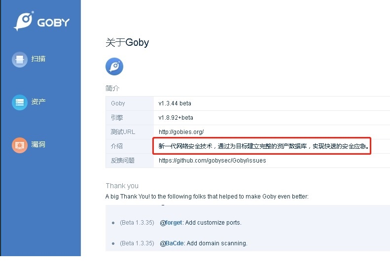
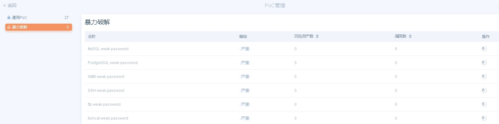
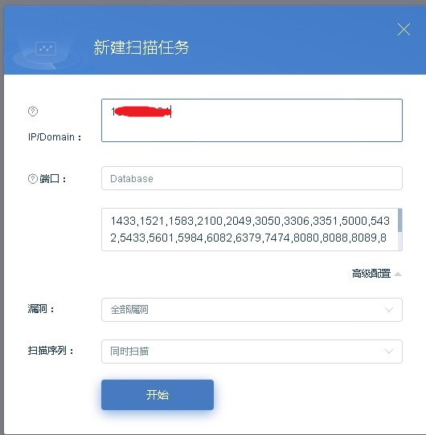

## Goby 使用体验  
Goby 是新近安全界大拿出品的一款内网安全扫描工具，其官网是：  

https://gobies.org  
https://github.com/gobysec/Goby  

 

工具是做什么用的？  
从关于界面可以看出一些端倪：建立完整的资产数据库，实现快速的安全应急。  
扫描主界面的提示语也是：帮企业梳理资产，暴露攻击面。  

可以通过配置 IP 地址，选择扫描端口以及定制化的漏洞来进行资产扫描。 
初步体验来看，主要有 3 个功能点：  
1）对于资产通过外网扫描的方式进行对外暴露的资产进行识别的功能，基于该功能可以方便地查看当前资源池中对外暴露的端口、服务  
2）基于内置的部分（当前是 27 条 PoC 漏洞规则）漏洞规则进行扫描，但内置的规则库目前只有 27 条，并不是与外网的权威漏洞库实时更新的，所以本身局限性是比较大的，从官网查看是有更新的策略的，但暂时还未体验到。因此想使用这款工具来替代安全检测设备还比较困难。  
3）针对 SSH、MySQL、ftp、tomcat 等几个服务的暴力破解功能可以识别资产是否存在可被爆破的可能（具体应该也跟弱密码库相关）  

从前面的一些安全产品的体验（天眼云镜、Nexpose、Goby、御见）来看，安全其实是一个体系，从基础的网络安全风险到主动入侵检测到安全流程规范包罗万象。目前没有银弹，甚至从前沿的安全信息来看，你断网都能有手段把机器给黑掉。所以，心理上首先要确立一点就是：安全不是一劳永逸，一锤子买卖。不能指望一套太祖长拳就四海无忧了。如果希望自身平台、产品具有较高的安全可靠性，就需要持续在这方面投入资源和能力。这些都会花钱的！  
安全产品检测扫描规则通常分 Agent、外网扫描两种模式。Agent 方式由于安装到了资产上，它本身可以采集的信息是最全面的，但采集的信息可能也包含本身不对外，实际风险不高的问题。而外网扫描模式更接近实际攻击的最大可能，外部攻击者通常采取的应该也是类似的策略，扫描一些端口看看有哪些主机，基于高危漏洞弱密码去检测主机是否存在被攻破可能。攻击者手中可能也是有一套工具包的，如果是顶尖的有组织的攻击者他们的弹药库可能是毁灭性的，要防御非常困难。从效率和效益上讲，普通平台、企业能够防止普通层级的攻击就不错了。  
树立良好的安全规范，勤打补丁、配置高强度密码、减少对外暴露端口，让自己的产品具有一定攻击的门槛，那么大多数无目的的攻击就会转而去寻找其他更容易攻击的用户。而安全产品的话，能找到一款较为实时更新权威漏洞库的工具，定时对自己平台进行扫描就很棒了。

  

  

  
