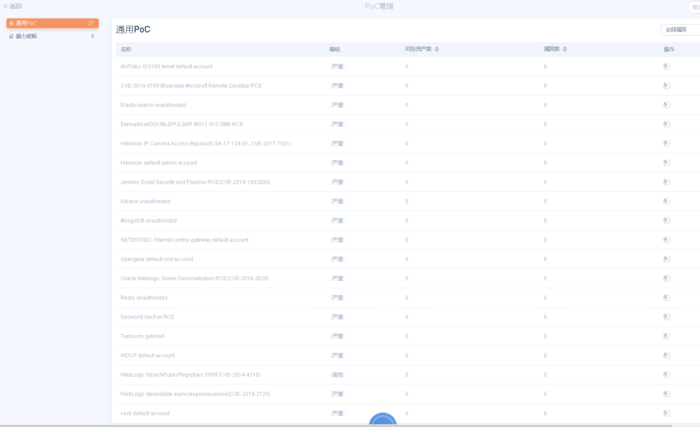

## Goby 使用体验  
Goby 是新近安全界大拿出品的一款内网安全扫描工具，其官网是：  

https://gobies.org  
https://github.com/gobysec/Goby  

可以通过配置 IP 地址，选择扫描端口以及定制化的漏洞来进行资产扫描。 
初步体验来看，主要有 3 个功能点：  
1）对于资产通过外网扫描的方式进行对外暴露的资产进行识别的功能，基于该功能可以方便地查看当前资源池中对外暴露的端口、服务  
2）基于内置的部分（当前是 27 条 PoC 漏洞规则）漏洞规则进行扫描，但内置的规则库目前只有 27 条，并不是与外网的权威漏洞库实时更新的，所以本身局限性是比较大的，从官网查看是有更新的策略的，但暂时还未体验到。因此想使用这款工具来替代安全检测设备还比较困难。  
3）针对 SSH、MySQL、MongoDB、ElasticSearch、Redis 等几个服务的暴力破解功能可以识别资产是否存在可被爆破的可能（具体应该也跟弱密码库相关）

