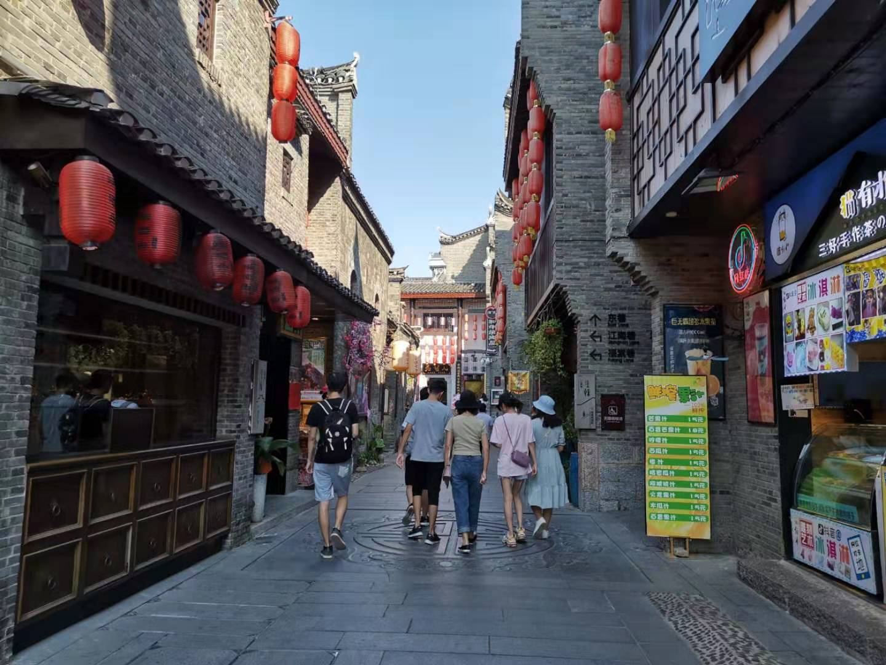
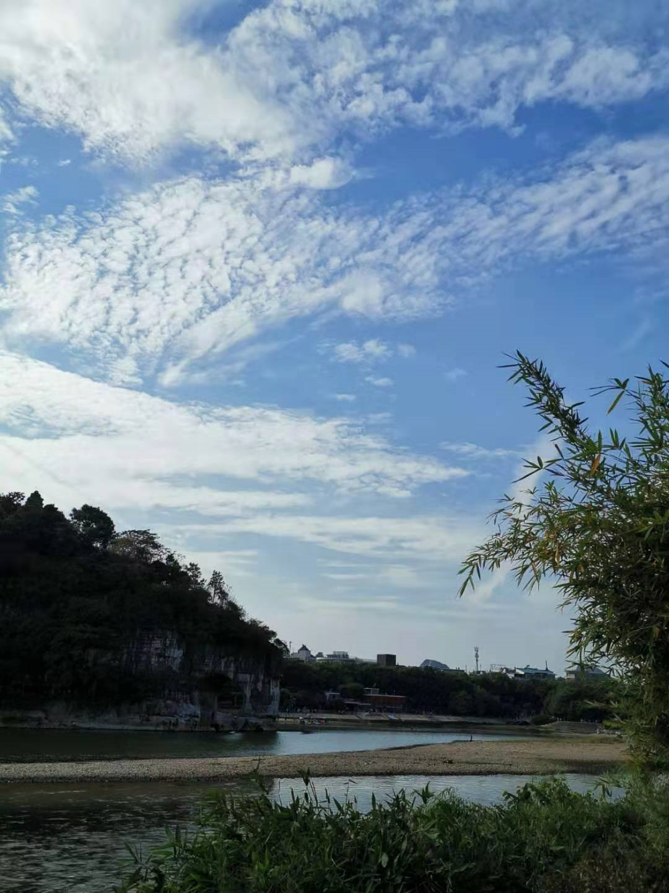
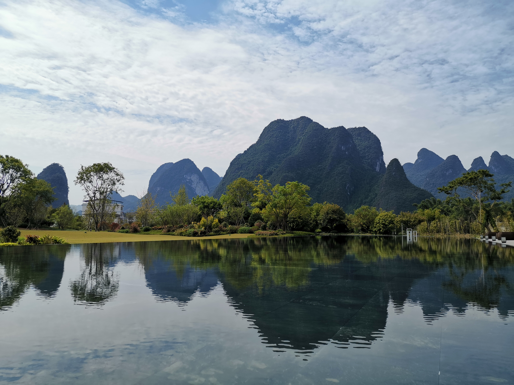
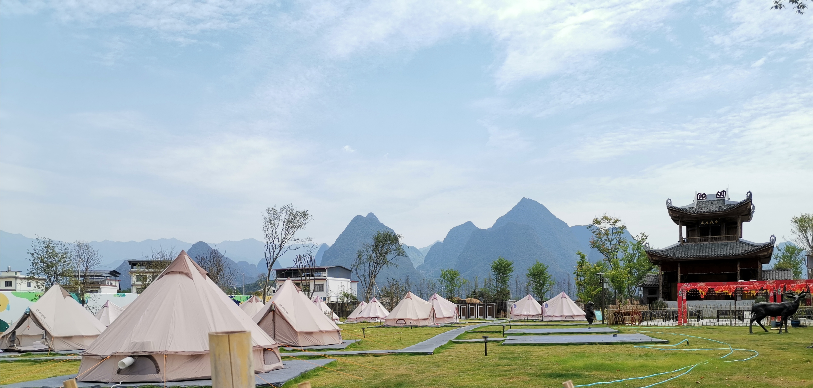
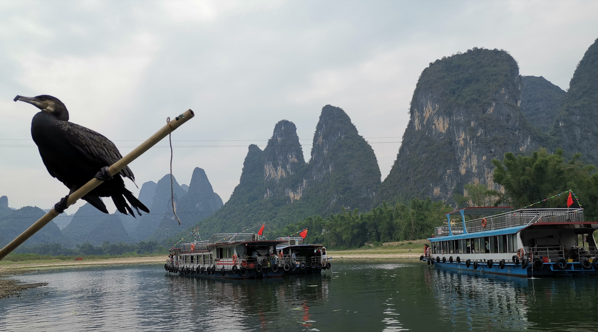
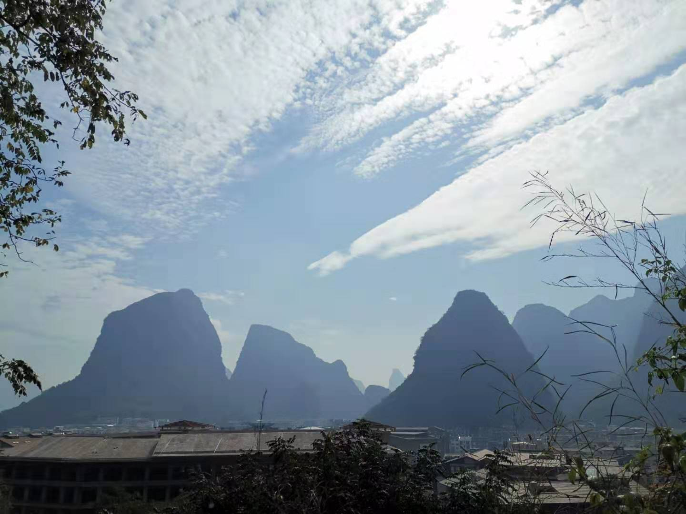
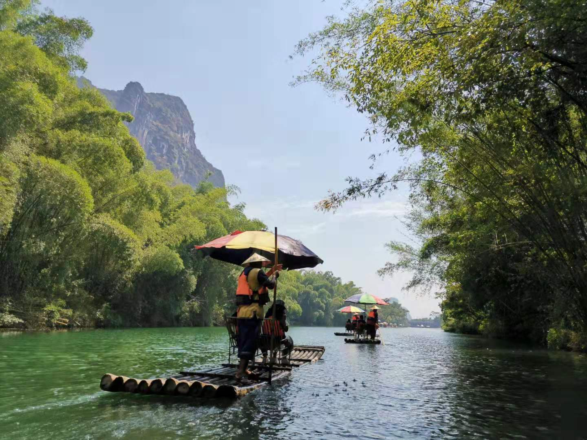
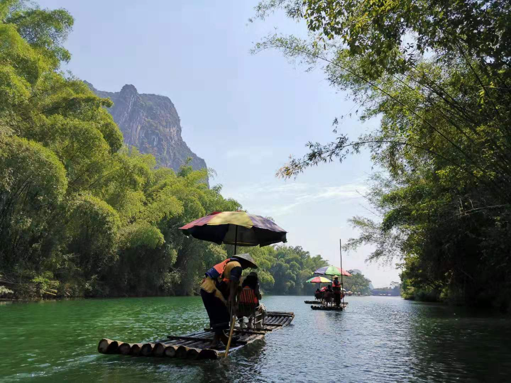
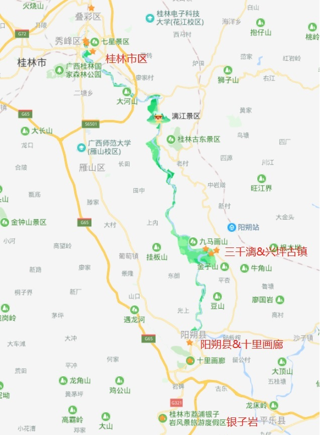
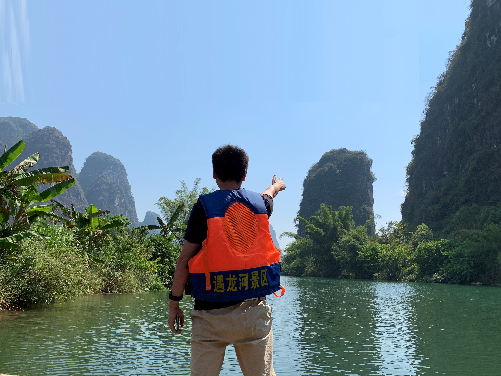

## 2019-桂林游记
2019年10.1前夕，趁着可以从项目中抽出来搭上了扫尾团的末班车，跟着同事们一起来到了桂林。  
桂林山水甲天下，象鼻山，渔舟唱晚和刘三姐是打小就刻在脑海里的广西印象。老婆也心心念念着想要来玩，却一直没规划成形，这一次就权当先锋了。  

全团一共14人，除去3个妹子外其他全是汉子，大多码农出身，全团散发一股子老年团的养生气。幸好还有三朵金花，路上时不时引起阵阵叽叽喳喳烘托起了愉悦的氛围。男女搭档，干活不累，又都是部门成团，没有太多防备心理，团里有几个青春少女还真是有极大的好处，想着去年的青海团似乎就缺了这味引子！  

本次旅程共3天2晚，第一天高铁到达桂林北已经是下午3点左右，先参观了象鼻山的“新景区”（为什么强调新景区，因为大家最熟悉的象鼻山图都是从旧景区拍摄的，新景区的角度其实不算很好，至少心理会有些落差。导游是说旧景区设施陈旧之类不提）。象鼻山景区本身不大，虽然当天有一些太阳，但也不推荐搭电瓶车，因为景区真不大，单程走路不过10多分钟。打卡而来，自然是图着照着模板拍个照，不过由于本身拍摄角度就不同且10月已经是枯水期，拍摄效果并未如意。  

  

逛完大家也都累了，吃了晚饭，不再想逛街直接回了酒店休息，高铁站北的亚朵，住宿条件确实不差，还有篮球场。楼下有米粉，按导游说的不要找名字带正宗的店，找到一家明桂米粉，要个5块钱份量，先不加汤，待吃完再打一勺汤吃，口味还不赖，有一点正宗的感觉。  
第二天9点出发，两个多小时到了三千漓景区，新开发，尚未完工，主打人文休闲，里面有一些人文艺术品商店和徐悲鸿展览馆，还有亲子度假园。游览吃饭了2个多小时，里面其实就一个以水做镜的景还不错。另有帐篷园，倒是适合给小情侣或者家庭小孩。如果是十一应该还会有沿河的灯光和舞台秀，不过本地只是逛了一下商铺，体验不佳。  

  
  

饭后入兴坪，找20元人名币的背景图所在。这里从检票口可以乘车前往，距离稍远。不过另外一点，如果不乘车，直接就可以在去的“浮桥”上把风景都领略，把照片都拍了，或许都可以不用乘邮轮了:)  
邮轮航路不远，先是顺水而下，居中一滩涂有老人携鸟乘筏而来，可以跟它们合个影5元一次，图个乐子。在20元背景中做造型是必不可少的，不过由于人多干扰多，要想安静拍几张满意的还比较麻烦。最好自带摄影师，选好角度，多试几个造型。  

  
  
  
下午是往银子岩。天然大溶洞，有一定深度和宽度，有各种倒悬的石菱和钟乳，有幽长的过道，溶洞爱好者或者未曾有钻过洞的可以去看看这类大自然的鬼斧神工。  
夜里逛阳朔西街，一开始以为是凤凰那种沿河，实际是闹事的一条商业街，除了有不少酒吧和兔女郎并无特色。 
晚上入住的是阳朔布谷公园内的美豪酒店（内有多个酒店），酒店处在十里画廊和阳朔县城中间位置。背靠几座青山，设有山脚儿童乐园、游泳池和凉亭，园区有较大的游乐活动空间，适合带家带小孩居住。早上还可以从游泳池旁的小路去爬山，爬到山肩处可以登高望远，远处山影相间，一番辛苦爬上来看到这倒是有一种心怀开阔。只不过注意山路虽然铺了水泥，但没有阶梯，是比较滑和陡的，要注意安全结伴最佳。  

   

第二日会往十里画廊去。十里画廊实则是一片山群区域，适合骑车漫游。骑车的路径就是限行的国道，靠边走即可，不过由于电动车、旅游车也不少所以还是要注意安全。整个景区有山、有水、有竹筏、有骑马、有观蝶、有热气球、有滑翔伞、有大榕树、有月亮山...在里面是可以慢一些，多花时间慢慢体验的。搭乘了最短的40分钟时间左右的竹筏，确实有人行明镜中的感觉，强烈推荐搭一次。可惜行程设计问题，只待了2个小时左右便匆匆离去，略微遗憾。可以考虑带一家人找个景区里人家休闲放松一两天。  

  
  
由于是枯水期，水不颠簸，本身水路也是设计得比较悠闲平缓，中途有3-4个人造堤坝做的斜坡用来构造冲水的体验。水路有深有浅，最深可能有5-6米，部分地方河水清澈见底，倒不见有游鱼。间歇有水草。在这时候一定要找好时机从椅子上站起来，走到船头看一看，划划水，洗洗脚，找着好风景就拍上几张。虽然从安全角度会有落水风险，如果能让船家把杆子借来撑几下，那也是很好的体验。我撑了，没撑起来！  

  
   

整体来讲，整个行程设计得一般，比较中意的就只有十里画廊的竹筏一段，连刘三姐也没时间去观看。返程路上，看《茶馆》时候一抬头看到窗外日落群山间十分壮观，可惜没抓拍到。下次来，还是做一些选择，如果是来看山看水，就找一两处静静呆一两天，深深体验会更好。

 

另外，桂林作为一个旅游城市已经有几十年的时间了，但整体规划设计和道路设计都不足。从桂林往阳朔，道路狭小，不清楚是否是由于本身山多，扩宽困难，新建又要破坏四周山体所以未做还是本身规划不足。另外，十里画廊内部的村民住房似乎不受约束，一栋栋小房子嵌在路边已经有破坏景观的趋势了。像老一辈文人雅士歌颂的行走在书画中的感觉应该很难体会到了。  

  
